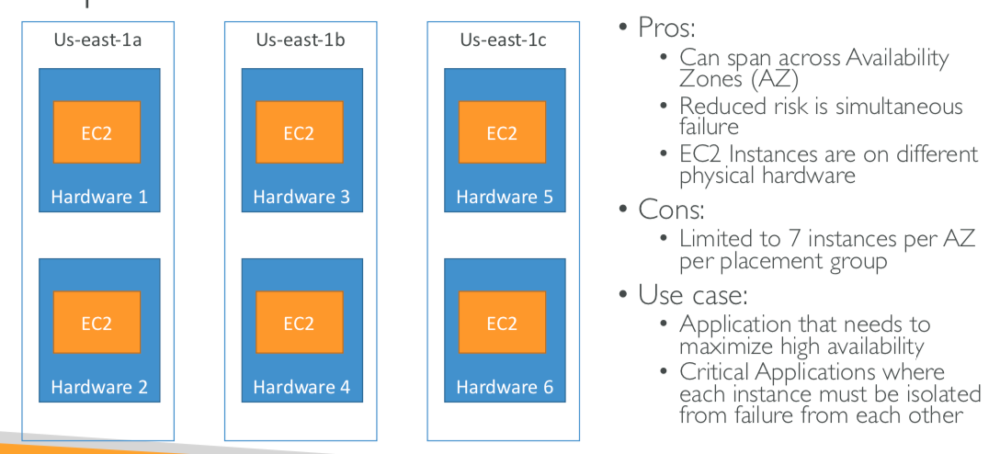

## 1. Basic
 - AWS region is a cluster of data centers.
 - Availability Zone is one or more descrete data centers.

 ## 2. IAM(Identity and Access Management)
 - IAM has a global view.
 - It's best to give users the minimal amount of permissions they need to perform their job.(least privilege principles)
 - One IAM User per physical person.
 - One IAM Role per application.
 - Never use the ROOT account except for initial setup.

 ## 3. EC2
 - Use SSH or EC2 Instance Connect to connect EC2.
 - EC2 Instance Connect only works with Amazon Linux 2.(need to make sure the port 22 is opened.)
 - Security groups are actiong as a firewall on EC2 Instance.
 - Security groups live outside the EC2.(If traffic is blocked, the EC2 instance won't see it)
 - It's good to maintain one separate security group for SSH access.
 - All inbound traffic is blocked by default.
 - All outbound traffic is authorised by default.
 - You can only have 5 Elastic IP in your account.
 - Try to avoid using Elastic IP.
 - Use random public IP and register a DNS name to it.
 - Or, use a Load Balancer and don't use a public IP.
 - It is possible to bootstrap out instances using an EC2 User Data.
 - User Data script is only run once at the instance first start.
 - **EC2 Instance Launch Types**
    - On Demand Instances: short workload, predictable pricing
    - Reserved: minimum 1 year
      - Reserved Instance: long workloads
      - Convertible Reserved Instances: long workloads with flexible instances.
      - Scheduled Reserved Instances: example - every Tue between 3 and 6 pm.
    - Spot Instances: short workloads, for cheap, can lose instances.
    - Dedicated Instnaces: no other customers will share your hardware.
    - Dedicated Hosts: book an entire physical server, control instance placement
 - EC2 Spot Instances are not great for critical jobs or databases.
 - **Great combo: Reserved Instances for baseline + On-Demand & Spot for peaks.**
 - **Instance Launch Type Price Comparison (asia-pacific-seoul, m4.large)**

|Launch Type|Price (per hour)|1 Month|
|-------|----|----|
|On-demand|$0.123|$88.56|
|Reserved (1 year)|$0.069|$49.68|
|Reserved (3 year)|$0.047|$33.84|
|Reserved Convertible (1 year)|$0.079|$56.88|
|Reserved Convertible (3 year)|$0.056|$40.32|
|Spot|$0.03|$21.6|

- **EC2 Instance Types**
  - R: application that needs a lot of RAM - in-memory caches
  - C: application that needs good CPU - compute / databases
  - M: application that are balanced - general / web app
  - I: application that need good local I/O - databases
  - G: application that need a GPU - video rendering / machine learning
  - T: burstable instances (up to a capacity) - micro servies / dev
- AMI can provide installing your app ahead of time. (for faster deploys when auto-scaling)
- AMI provides Pre-installed pakages needed.
- AMI provides Faster boot time. (no need for ec2 user data at boot time)
- AMI are built for a specific AWS region.
- AMI live in Amazon S3
- Plcaement Groups (EC2 placement strategies)
  - Cluster 
  - Spread 
  - Partition 
