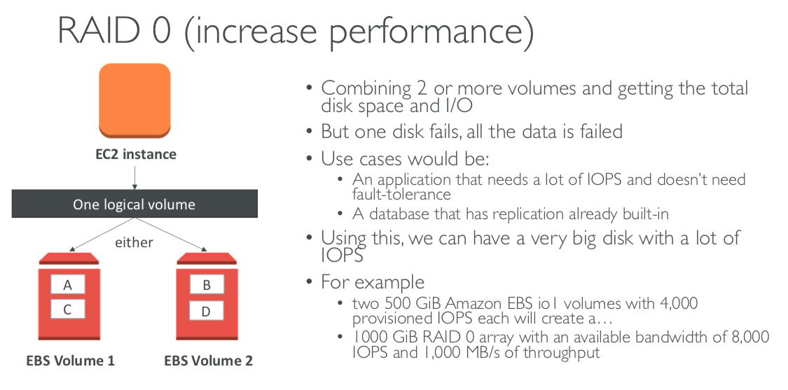
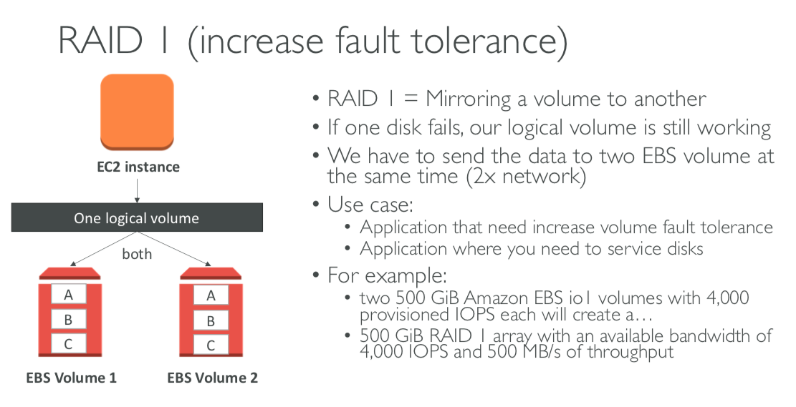

## 1. EBS
- EC2 machin loses its root volume (main drive) when it is manually terminated.
- EBS Volume is a network drive you can attach to your instances.
- It's locked to an Availability Zone.
- EBS Volume Types
  - GP2 (SSD): General purpose SSD volume that balances price and performance for a wide variety of workloads.
  - IOI (SSD): Highest performance SSD volume for mission-critical low-latency or high-throughput workloads.
  - STI (HDD): Low cost HDD volume designed for frequently accessed, throughput-intensive workloads.
  - SCI (HDD): Lowest cost HDD volume designed for less frequently accessed workloads.
- Only GP2 and IOI can be used as boot volumes.
- To migrate EBS to a different AZ or region,
  - 1. Snapshot the volume
  - 2. Create a volume from the snapshot in the AZ / region of your choice
- To encrypt an unencrypted EBS volume,
  - 1. Create an EBS snapshot of the volume
  - 2. Encrypt the EBS snapshot
  - 3. Create new EBS from the snapshot
  - 4. Attach the encrypted volume to the original instance
- Some instance do not come with Root EBS volumes.
- Instead, they come with Instance Store.
- Instance Store is physically attached to the machine.
- Instance Store has better I/O performance but it is lost when EC2 stoped or terminated.
- With EBS, RAID 0 and RAID 1 is possible.
  - RAID 0 
  - RAID 1 

## 2. EFS
- EFS works with EC2 Instances in multi-AZ
- Highly avaiable, scalable, expensive
- EFS pays per use.
- File system scales automatically, pay-per-use, no capacity planning.
- Only for Lunux Instances.
