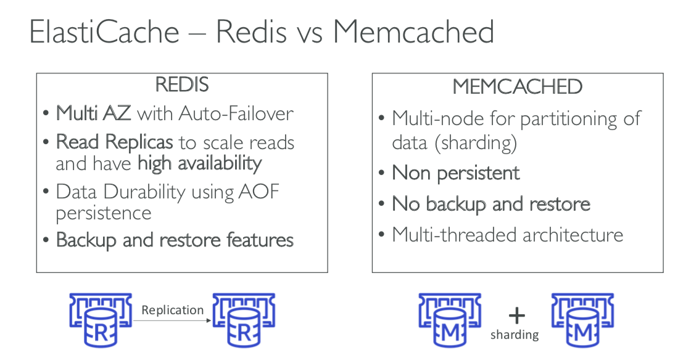

## 1. RDS
- Backups are automatically enabled in RDS. (7 days retention)
- DB snapshots can be manually triggered by the user.
- Up to 5 Read Replicas within AZ, Cross AZ or Cross Region.
- Replica can be promoted to their own DB.
- To reduce the cost, set your Read Replicas in the same AZ.
- RDS provides Multi-AZ feature. (standby instance)
- Possible to encrypt the RDS with AWS KMS / AES-256.
- Encryption has to be defiend at launch time.
- To encrypt an un-encrypted RDS database, create new one from snapshot.
- RDS database are usually deployed within a private subnet.
- To connect RDS in private subnet, use AWS Client VPN (virtual) or AWS Direct Connect (physical). Or, use Bastion Host if you only need to use DB client.
  - AWS Client VPN 
  - AWS Bastion Host 
  - AWS Direct Connect 

## 2. Aurora
- MySQL and Postgres are both supported as Aurora DB.
- Aurora claims 5x performace improvement over MySQL on RDs, over 3x the performance of Postgres on RDS.
- Aurora can have 15 replicas.
- Aurora costs 20% more than RDS.
- Aurora is High Availability native. (automatic fail-over)
- On instance failure, Aurora makes one of your Read replicas to master.
- You need at least one Read replicas in another AZ for fast HA. (unless it will take time to create new one)
- Aurora storage automatically grows in increments of 10GB, up to 64TB.

## 3. ElastiCache
- Caches are in-memory databases with really high performance, low latency.
- Using ElastiCache involves heavy application code changes.
- ElastiCache Example 
- Redis vs Memcached 

  #### reference
  - [musma](https://musma.github.io/2019/11/04/aws-client-vpn-endpoint.html)
